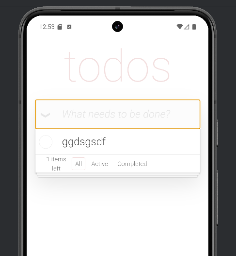
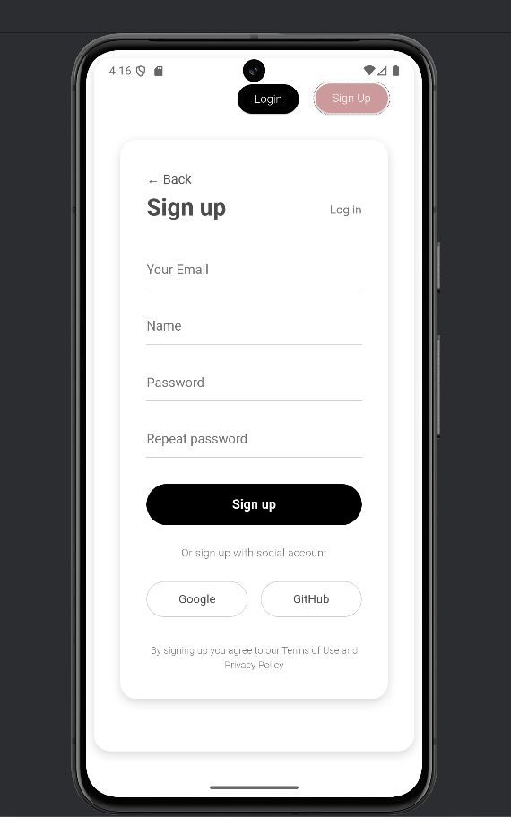
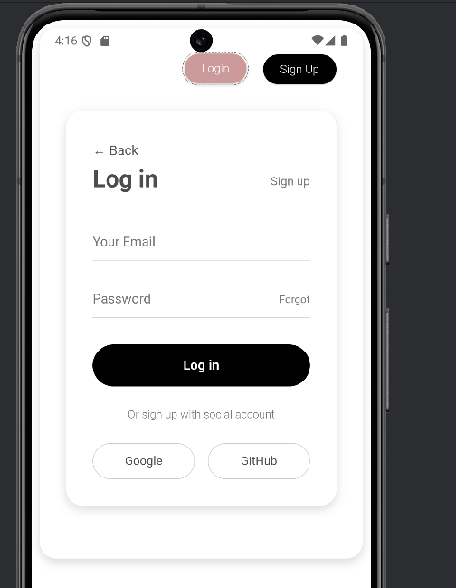

# 📱 Todo App Mobile

Мобільний додаток для управління завданнями з інтуїтивним інтерфейсом та зручною функціональністю.

## ✨ Функціональність

- ➕ **Додавання завдань**
- ✅ **Відмітка виконаних завдань** одним дотиком
- 🗑️ **Видалення завдань** кнопкою
- 📝 **Редагування завдань** на місці
- 💾 **Локальне збереження** даних (видалено)
- 💾 **Збереження в FireBise** даних
- 📝 **Авторизація користувачів** за допомогою FireBase

## 🛠 Технології

- **React** / **Ionic React** - мобільна розробка
- **React Route** - для роутингу в програмі
- **TypeScript** - типізація коду
- **React Hooks** - управління станом
- **CSS/SCSS** - стилізація
- **IonicStorage** - збереження даних локально (вже не використовується)
- **FireBase** - для авторизації користувачів та збереження даних

## 🌐 Демо

🔗 **[Переглянути живий проєкт](https://ivsasha.github.io/todo-app-mobile/)**

## 📸 Скріншоти

