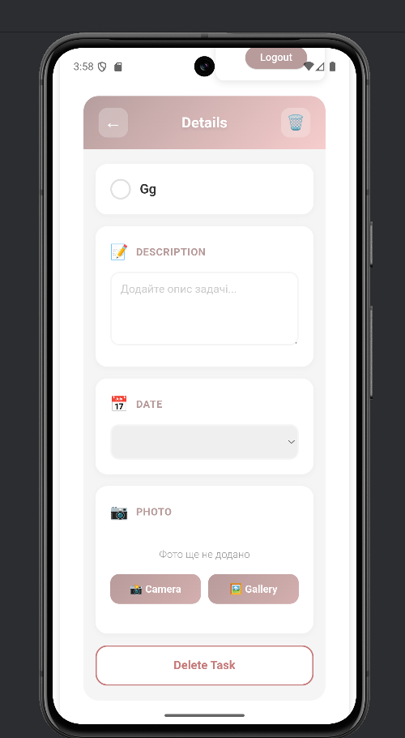

# 📱 Todo App Mobile

Мобільний додаток для управління завданнями з інтуїтивним інтерфейсом та розширеною функціональністю.

## ✨ Функціональність

### Основні можливості

- ➕ **Додавання завдань** з текстом та описом
- ✅ **Відмітка виконаних завдань** одним дотиком
- 🗑️ **Видалення завдань** з підтвердженням через Action Sheet
- 📝 **Редагування завдань** на місці
- 📅 **Встановлення терміну виконання** (Due Date) з використанням Date Picker
- 📷 **Додавання фото** до завдань з камери або галереї
- 📳 **Вібраційний відгук** при додаванні та відмітці завдань

### Безпека

- 🔐 **Авторизація користувачів** через Firebase Authentication
- 👤 **Реєстрація нових користувачів**
- 🔄 **Відновлення паролю** через функцію "Забув пароль"

### Зберігання даних

- ☁️ **Firebase Firestore** - база даних для завдань
- 🖼️ **Firebase Storage** - зберігання фотографій
- 🌐 **Перевірка з'єднання** - додаток вимагає активного інтернет-з'єднання

## 🛠 Технології

### Frontend

- **React** / **Ionic React** - мобільна розробка
- **React Router** - роутинг в додатку
- **TypeScript** - типізація коду
- **React Hooks** - управління станом
- **CSS/SCSS** - стилізація

### Backend & Services

- **Firebase Authentication** - авторизація користувачів
- **Firebase Firestore** - хмарна база даних
- **Firebase Storage** - зберігання файлів

## 🌐 Демо

🔗 **[Переглянути живий проєкт](https://ivsasha.github.io/todo-app-mobile/)**

## 📸 Скріншоти

